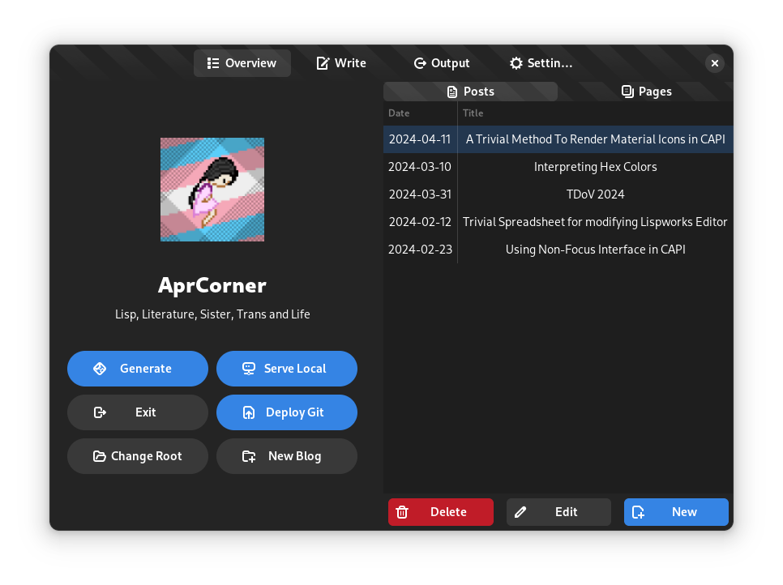

# Aprblog

Just my own blogging framework. Build with Common Lisp.

Site generating using various Common Lisp libraries, mainly `djula`, `cxml`, `3bmd`.

Using Djula & Django-like template system

With GUI blog manager using `cl-gtk4`

Dependencies:
- gtk4
- gobject-introspection
- libadwaita
- gtksourceview

